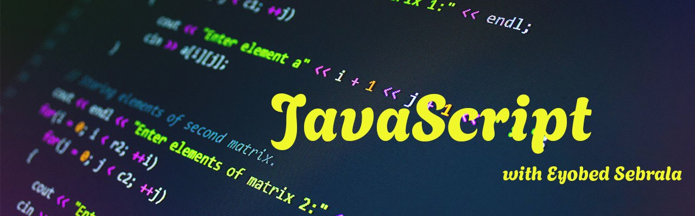

# JavaScript for Absolute Beginners By Eyobed 

Welcome to your beginner guide to JavaScript. Each "slide" is a topic. Use the outline below to navigate.

---

## 🧭 Outline

1. [Console and `console.log()`](#1-console-and-consolelog)  
2. [Variables](#2-variables)  
3. [Data Types: Number](#3-data-types-number)  
4. [Data Types: String](#4-data-types-string)  
5. [Math Operators](#5-math-operators)  
6. [Operator Precedence (BIDMAS)](#6-operator-precedence-bidmas)  
7. [Shorthand Operators](#7-shorthand-operators)  
8. [NaN](#8-nan)  
9. [String Interpolation (Backticks)](#9-string-interpolation-backticks)  
10. [Undefined](#10-undefined)  
11. [Null](#11-null)  
12. [Arrays](#12-arrays)  
13. [Boolean Data Type](#13-boolean-data-type)  
14. [Control Flow (Loops)](#14-control-flow-loops)  
15. [Conditional Statements](#15-conditional-statements-if-else-else-if)  
16. [Logical Operators](#16-logical-operators)
17. [Practice Exercise: Student Grading System](#17-practice-exercise-student-grading-system)
18. [Break and Continue (in for loop with if clause)](#18-break-and-continue-in-for-loop-with-if-clause)
19. [Switch Statement](#19-switch-statement)
20. [Variable and Block Scope](#20-variable-and-block-scope)
21. [Functions: Declaration, Expression, Arguments, and Parameters](#21-functions-declaration-expression-arguments-and-parameters)
22. [Default Values in Parameters](#22-default-values-in-parameters)  
23. [Function Return Values](#23-function-return-values)  
24. [Arrow Function](#24-arrow-function)
25. [DOM (Document Object Model)](#25-dom-document-object-model)


---
## 1. Console and `console.log()`

youtube video link from minute 5:17-722
[console](https://youtu.be/FhguwBJeqWs?list=PL4cUxeGkcC9haFPT7J25Q9GRB_ZkFrQAc)

- The **console** is a tool to test and debug JavaScript.
- `console.log()` prints messages to the browser console.

```javascript
console.log("Hello, JavaScript beginner!"); // This will show the message in the console
```
[Exercise](https://github.com/eyobed7/JavaScript-Exercise/blob/main/README.md)

---

## 2. Variables

youtube video link from minute 7:57-14:30
[variable](https://youtu.be/FhguwBJeqWs?list=PL4cUxeGkcC9haFPT7J25Q9GRB_ZkFrQAc)

- Variables store data. Think of them like containers.

```javascript
let name = "Eyobed"; // using let
const pi = 3.14; // using const for values that don't change
var age = 25; // older way, not recommended now
```
[Exercise](https://github.com/eyobed7/JavaScript-Exercise/blob/main/README.md)

---

## 3. Data Types: Number

youtube video link from minute 16:40-40:00
[number](https://youtu.be/FhguwBJeqWs?list=PL4cUxeGkcC9haFPT7J25Q9GRB_ZkFrQAc)

- Numbers can be integers or decimals.

```javascript
let score = 100;
let price = 19.99;

console.log(score + price); // 119.99
```
[Exercise](https://github.com/eyobed7/JavaScript-Exercise/blob/main/README.md)

---

## 4. Data Types: String

youtube video link from minute 20:36-36:00
[string](https://youtu.be/FhguwBJeqWs?list=PL4cUxeGkcC9haFPT7J25Q9GRB_ZkFrQAc)

- Strings are text wrapped in quotes.

```javascript
let firstName = "Eyobed";
let lastName = "Sebrala";

// Concatenation with +
let fullName = firstName + " " + lastName;
console.log(fullName); // Eyobed Sebrala

// Getting character by index
console.log(fullName[0]); // E

// Properties
console.log(fullName.length); // 15

// Methods
console.log(fullName.toUpperCase()); // EYOBED SEBRALA
console.log(fullName.toLowerCase()); // eyobed sebrala
console.log(fullName.indexOf("e")); // returns first index of 'e'
console.log(fullName.lastIndexOf("e")); // returns last index of 'e'
console.log(fullName.slice(0, 6)); // Eyobed
console.log(fullName.substr(7, 7)); // Sebrala
console.log(fullName.replace("Eyobed", "Eyo")); // Eyo Sebrala
```
[Exercise](https://github.com/eyobed7/JavaScript-Exercise/blob/main/README.md)

---

## 5. Math Operators

youtube video link from minute 37:40-40:50
[maths](https://youtu.be/FhguwBJeqWs?list=PL4cUxeGkcC9haFPT7J25Q9GRB_ZkFrQAc)

- Used for calculations: `+`, `-`, `*`, `/`, `%`, `**`

```javascript
let radius = 7;
const pi = 3.14159;
let area = pi * radius ** 2; // Area of a circle
console.log(area); // 153.938

let a = 10;
let b = 3;
console.log(a % b); // 1 (remainder)
```
[Exercise](https://github.com/eyobed7/JavaScript-Exercise/blob/main/README.md)

---

## 6. Operator Precedence (BIDMAS)

youtube video link from minute 40:00-41:50
[maths](https://youtu.be/FhguwBJeqWs?list=PL4cUxeGkcC9haFPT7J25Q9GRB_ZkFrQAc)

- **BIDMAS**: Brackets, Indices, Division/Multiplication, Addition/Subtraction

```javascript
let result = 2 + 3 * 4; // 2 + 12 = 14
let correct = (2 + 3) * 4; // 5 * 4 = 20
console.log(result);
console.log(correct);
```
[Exercise](https://github.com/eyobed7/JavaScript-Exercise/blob/main/README.md)
---

## 7. Shorthand Operators

```javascript
let count = 5;
count++; // increases by 1
count--; // decreases by 1

count += 3; // adds 3
count -= 2; // subtracts 2
count *= 2; // multiplies by 2
count /= 2; // divides by 2

console.log(count); // check final value
```
[Exercise](https://github.com/eyobed7/JavaScript-Exercise/blob/main/README.md)

---

## 8. NaN

- **NaN** stands for “Not a Number”

```javascript
let result = 100 / "Eyobed";
console.log(result); // NaN
```
[Exercise](https://github.com/eyobed7/JavaScript-Exercise/blob/main/README.md)

---

## 9. String Interpolation (Backticks)

- Use backticks `` ` `` and `${}` to embed variables in strings

```javascript
let name = "Eyobed";
let age = 25;
let message = `Hello, my name is ${name} and I am ${age} years old.`;
console.log(message);
```
[Exercise](https://github.com/eyobed7/JavaScript-Exercise/blob/main/README.md)

---

## 10. Undefined

- A variable declared but not given a value is `undefined`.

```javascript
let test;
console.log(test); // undefined
```
[Exercise](https://github.com/eyobed7/JavaScript-Exercise/blob/main/README.md)

---

## 11. Null

- `null` is an intentional empty value.

```javascript
let data = null;
console.log(data); // null
```
[Exercise](https://github.com/eyobed7/JavaScript-Exercise/blob/main/README.md)

---

## 12. Arrays

- Arrays store multiple values in one variable.

```javascript
let colors = ["red", "green", "blue"];

console.log(colors[0]); // red
console.log(colors.length); // 3

// Methods
console.log(colors.join(" - ")); // "red - green - blue"

let moreColors = ["yellow", "purple"];
let allColors = colors.concat(moreColors);
console.log(allColors); // merges arrays

colors.push("black"); // adds to end
console.log(colors); 

colors.pop(); // removes last element
console.log(colors); 

console.log(colors.indexOf("green")); // 1
```
[Exercise](https://github.com/eyobed7/JavaScript-Exercise/blob/main/README.md)

---

## 13. Boolean Data Type

- Booleans represent **true** or **false** values.

```javascript
let isOnline = true;
let hasAccess = false;

console.log(typeof isOnline); // boolean
console.log(5 > 3); // true
console.log(10 === "10"); // false (different types)
```
[Exercise](https://github.com/eyobed7/JavaScript-Exercise/blob/main/README.md)

---

## 14. Control Flow (Loops)

- Control flow means the order in which the code runs.
- Loops let you repeat tasks.

### `for` Loop

```javascript
// Print numbers 1 to 5
for (let i = 1; i <= 5; i++) {
  console.log(i);
}
```

### `while` Loop

```javascript
let count = 1;
while (count <= 5) {
  console.log(count);
  count++;
}
```

### `do...while` Loop

```javascript
let num = 1;
do {
  console.log(num);
  num++;
} while (num <= 5);
```

- `do...while` runs **at least once**, even if the condition is false.
[Exercise](https://github.com/eyobed7/JavaScript-Exercise/blob/main/README.md)

---

## 15. Conditional Statements (`if`, `else`, `else if`)

- They let you run code only when certain conditions are met.

```javascript
let score = 85;

if (score >= 90) {
  console.log("Excellent!");
} else if (score >= 75) {
  console.log("Very Good!");
} else {
  console.log("Keep trying!");
}
```
[Exercise](https://github.com/eyobed7/JavaScript-Exercise/blob/main/README.md)

---

## 16. Logical Operators

- Used to combine conditions.

| Operator | Description       | Example                  | Result         |
|----------|-------------------|--------------------------|----------------|
| `&&`     | AND (both true)   | `true && false`          | false          |
| `||`     | OR (at least one) | `true || false`          | true           |
| `!`      | NOT (opposite)    | `!true`                  | false          |

```javascript
let age = 20;
let hasTicket = true;

if (age >= 18 && hasTicket) {
  console.log("You can enter.");
}

if (age < 18 || !hasTicket) {
  console.log("Entry denied.");
}
```
[Exercise](https://github.com/eyobed7/JavaScript-Exercise/blob/main/README.md)

---

## 17. Practice Exercise: Student Grading System

Let’s put together everything we've learned to build a mini student grading system.

### 📝 Problem:

You are a teacher who needs to process student scores and return feedback based on the score, attendance, and behavior.

### ✅ Features:

- Store student information (name, score, attendance, and behavior).
- Use conditions to determine the final message.
- Use loops to process multiple students.
- Apply string and math methods.
- Use arrays to store student records.

---


## 18. Break and Continue (in for loop with if clause)

### 🔄 What are `break` and `continue`?

- `break` stops the loop entirely.
- `continue` skips the current iteration and moves to the next one.

### 🧪 Example:

We will loop through numbers 1 to 10.

- If the number is 5, we `continue` (skip it).
- If the number is 8, we `break` (stop the loop).

```javascript
for (let i = 1; i <= 10; i++) {
  // Skip number 5
  if (i === 5) {
    continue;
  }

  // Stop loop at number 8
  if (i === 8) {
    break;
  }

  console.log(i);
}

// Output:
// 1
// 2
// 3
// 4
// 6
// 7
```
[Exercise](https://github.com/eyobed7/JavaScript-Exercise/blob/main/README.md)

---
## 19. Switch Statement

### 🔁 What is a `switch`?

A `switch` statement is a cleaner way to handle multiple `if-else` conditions that depend on a single variable's value.

### 🧪 Example:

Let’s use `switch` to determine the day of the week based on a number.

```javascript
let day = 3; // Let's say 1 is Monday, 2 is Tuesday, ..., 7 is Sunday

switch (day) {
  case 1:
    console.log("Monday"); // Runs if day === 1
    break;
  case 2:
    console.log("Tuesday"); // Runs if day === 2
    break;
  case 3:
    console.log("Wednesday"); // Runs if day === 3
    break;
  case 4:
    console.log("Thursday");
    break;
  case 5:
    console.log("Friday");
    break;
  case 6:
    console.log("Saturday");
    break;
  case 7:
    console.log("Sunday");
    break;
  default:
    console.log("Invalid day"); // Runs if none of the cases match
}

```
[Exercise](https://github.com/eyobed7/JavaScript-Exercise/blob/main/README.md)

---

## 20. Variable and Block Scope

### 📦 What is Scope?

**Scope** determines where a variable can be accessed in your code. There are two common types:

1. **Global Scope** – variables declared outside any block or function.
2. **Block Scope** – variables declared inside a block (`{}`), like in `if`, `for`, or functions, and only accessible there.

---

### 🔐 Example 1: Global vs Block Scope

```javascript
let name = "Eyobed"; // global variable

if (true) {
  let age = 25; // block-scoped variable
  console.log("Inside block:");
  console.log(name); // ✅ accessible
  console.log(age);  // ✅ accessible
}

console.log("Outside block:");
console.log(name); // ✅ still accessible
// console.log(age); // ❌ Uncaught ReferenceError: age is not defined

```
[Exercise](https://github.com/eyobed7/JavaScript-Exercise/blob/main/README.md)

---

## 21. Functions: Declaration, Expression, Arguments, and Parameters

### 🧠 What is a Function?

A **function** is a reusable block of code that performs a specific task when called.

---

### 📝 Function Declaration

This is the standard way to define a function:

```javascript
function greet() {
  console.log("Hello, world!");
}

greet(); // Call the function
```
[Exercise](https://github.com/eyobed7/JavaScript-Exercise/blob/main/README.md)

---

## 21. Functions: Declaration, Expression, Arguments, and Parameters

### 🧠 What is a Function?

A **function** is a reusable block of code that performs a specific task when called.

---

### 📝 Function Declaration

This is the standard way to define a function:

```javascript
function greet() {
  console.log("Hello, world!");
}

greet(); // Call the function
```

> This type of function can be called before it's defined in the code due to **hoisting**.

---

### 📝 Function Expression

A function assigned to a variable:

```javascript
const sayHi = function () {
  console.log("Hi there!");
};

sayHi(); // Call the function
```

> Function expressions are **not hoisted**, so they must be defined before use.

---

### 🎯 Parameters vs Arguments

* **Parameters** are variables listed in the function definition.
* **Arguments** are the actual values passed when calling the function.

```javascript
function add(x, y) { // x and y are parameters
  console.log(x + y);
}

add(5, 3); // 5 and 3 are arguments
// Output: 8
```

---

### 💡 Why Use Functions?

* Reduce repetition
* Improve readability
* Enable modular coding

[Exercise](https://github.com/eyobed7/JavaScript-Exercise/blob/main/README.md)

---
---

## 22. Default Values in Parameters
youtube video link from minute 12:18-13:31
[Default Values in Parameters](https://youtu.be/xUI5Tsl2JpY?list=PL4cUxeGkcC9haFPT7J25Q9GRB_ZkFrQAc)

In JavaScript, you can assign default values to function parameters. These values are used if no argument is passed.

```javascript
function greet(name = "Student") {
  console.log("Hello, " + name + "!");
}

greet(); // Output: Hello, Student!
greet("Eyobed"); // Output: Hello, Eyobed!
```

> 🧠 This helps avoid `undefined` values when arguments are missing.

---

## 23. Function Return Values
youtube video link from minute 14:02-18:00
[Return Values](https://youtu.be/xUI5Tsl2JpY?list=PL4cUxeGkcC9haFPT7J25Q9GRB_ZkFrQAc)

Functions can return a value using the `return` keyword. The returned value can be stored in a variable or used directly.

```javascript
function add(x, y) {
  return x + y;
}

let result = add(5, 3); // result is 8
console.log(result); // Output: 8
```

> 🧠 `return` stops function execution and outputs a value.

---

## 24. Arrow Function
youtube video link from minute 18:31-21:50
[Arrow Function](https://youtu.be/xUI5Tsl2JpY?list=PL4cUxeGkcC9haFPT7J25Q9GRB_ZkFrQAc)

Arrow functions are a shorter way to write functions. They are useful for simpler tasks.

### Basic Syntax:
```javascript
const greet = () => {
  console.log("Hello!");
};

greet(); // Output: Hello!
```

### With Parameters:
```javascript
const add = (a, b) => a + b;

console.log(add(4, 6)); // Output: 10
```

> ✅ Arrow functions don't have their own `this`, which is useful in some advanced cases.
---

## 25. DOM (Document Object Model)

### 🧠 What is the DOM?

The **DOM** is a programming interface created by the browser when an HTML page loads. It allows JavaScript to **interact with, modify, and control** elements on a web page.

---

### 🖱️ Interacting with a Browser Using JavaScript

With JavaScript, we can:

- Add or change content
- Modify styles
- React to user events (like clicking)
- Create popups and animations

---

### 📝 Adding Content to the Browser

```html
<p id="demo">Original Text</p>
<script>
  document.getElementById("demo").innerText = "This text was changed with JavaScript!";
</script>
```

---

### 🎨 Changing CSS Styles

```html
<div id="box" style="width:100px; height:100px; background:red;"></div>
<script>
  document.getElementById("box").style.background = "blue";
</script>
```

---

### 🖱️ Reacting to User Events (Click)

```html
<button onclick="alert('You clicked me!')">Click Me</button>
```

Or using JavaScript:

```html
<button id="btn">Click Me</button>
<script>
  document.getElementById("btn").addEventListener("click", function() {
    alert("Button clicked!");
  });
</script>
```

---

### 🎉 Cool Effects (Popups)

```html
<script>
  alert("Welcome to the page!");
  confirm("Do you want to continue?");
  prompt("What's your name?");
</script>
```

---

### ➕ Add or Delete Content

```html
<ul id="list">
  <li>Item 1</li>
</ul>

<script>
  // Add a new item
  let li = document.createElement("li");
  li.innerText = "Item 2";
  document.getElementById("list").appendChild(li);

  // Delete the first item
  document.getElementById("list").removeChild(document.querySelector("li"));
</script>
```

---

### 🔍 Selecting Elements (Querying)

We can reach into the DOM to select elements using:

#### 🔹 `getElementById`
```javascript
const title = document.getElementById("main-title");
```

#### 🔹 `getElementsByClassName`
```javascript
const buttons = document.getElementsByClassName("btn");
```

#### 🔹 `getElementsByTagName`
```javascript
const allParas = document.getElementsByTagName("p");
```

#### 🔹 `querySelector` (selects the first match)
```javascript
const firstButton = document.querySelector(".btn");
```

#### 🔹 `querySelectorAll` (selects all matches)
```javascript
const allButtons = document.querySelectorAll(".btn");
```

---

### 🧾 innerText and innerHTML

```html
<p id="msg">Hello</p>

<script>
  // innerText shows just the text
  document.getElementById("msg").innerText = "Updated text!";

  // innerHTML can include HTML tags
  document.getElementById("msg").innerHTML = "<b>Bold text</b>";
</script>
```

---

## 2️⃣ Modifying Elements

Once an element is selected, we can **change its content** or **style**.

### 🔹 Change Text

```javascript
header.textContent = 'New Header Text';
```

### 🔹 Change HTML

```javascript
header.innerHTML = '<span style="color: red;">Red Header</span>';
```

### 🔹 Change CSS Style

```javascript
header.style.color = 'blue';
header.style.fontSize = '30px';
```

---

## 3️⃣ Creating and Removing Elements

We can also **add new elements** or **remove existing ones**.

### 🔹 Create Element

```javascript
let newDiv = document.createElement('div');
newDiv.textContent = 'I am new!';
document.body.appendChild(newDiv); // adds it to the bottom of the page
```

### 🔹 Remove Element

```javascript
document.body.removeChild(newDiv); // removes it from the page
```

---

## 4️⃣ Responding to User Events

JavaScript can **listen and respond to user actions** like clicks, typing, hovering, etc.

### 🔹 Add Event Listener

```javascript
let button = document.getElementById('myButton');

button.addEventListener('click', function() {
  alert('Button clicked!');
});
```

### 🔹 Event Handler Function

```javascript
function handleHover(event) {
  event.target.style.backgroundColor = 'yellow';
}

let item = document.querySelector('.item');
item.addEventListener('mouseover', handleHover);
```

---

## 🎥 Video Resources

### 📹 Introduction to the DOM

- Watch this video to understand DOM and see how manipulation works:  
👉 [Watch Now](https://youtu.be/wKBu_dEaF9E)

### 📺 DOM Manipulation Playlist

- A complete playlist to help you learn DOM by building a project:  
👉 [Watch the Playlist](https://www.youtube.com/playlist?list=PLillGF-RfqbY2tmQtfuE1d_2Z5o8zrcz5)

> 📌 **Note:** Code along the videos for better understanding!

---

## ✅ Summary

| Task | Method |
|------|--------|
| Select by ID | `getElementById()` |
| Select one element | `querySelector()` |
| Select multiple elements | `querySelectorAll()` |
| Create new element | `createElement()` |
| Add element | `appendChild()` |
| Remove element | `removeChild()` |
| Listen to events | `addEventListener()` |

---


> 🧠 DOM lets us make our web pages interactive, responsive, and dynamic!


